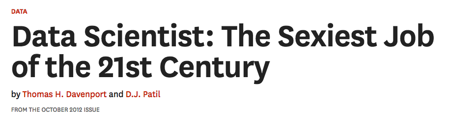

---
# YAML metadata
title: "What should a national data science strategy look like?"
author: "Matthew Brett"
linkcolor: blue
urlcolor: blue
bibliography: data-science-bib/data_science.bib
<#ifndef HANDOUT>
suppress-bibliography: true
<#endif>
---

# Context

> The demand for skills in data science and AI across all sectors is growing
> rapidly but this demand cannot be met. As a national institute The Turing
> has a key role to play in the national skills agenda and it is part of our
> mission to train new generations.
>
> We are now looking for a highly motivated and inspirational leader to
> position the Institute within this landscape by developing and driving an
> ambitious skills strategy.

# Some definitions

* Data science - ?
* Artificial intelligence.

# Data science

{width=100%}

# Initial response

> The now-contemplated field of Data Science amounts to a superset of the
> fields of statistics and machine learning which adds some technology for
> ‘scaling up’ to ‘big data’.

[@donoho201550]

# This response is unlikely to be fruitful

> The now-contemplated field of Data Science amounts to a superset of the
> fields of statistics and machine learning which adds some technology for
> ‘scaling up’ to ‘big data’. This chosen superset is motivated by commercial
> rather than intellectual developments. Choosing in this way is likely to
> miss out on the really important intellectual event of the next fifty years.

[@donoho201550]

# The data scientist in industry

> When Jeff Hammerbacher and I talked about our data science teams, we
> realized that as our organizations grew, we both had to figure out what to
> call the people on our teams. “Business analyst” seemed too limiting. “Data
> analyst” was a contender, but we felt that title might limit what people
> could do. After all, many of the people on our teams had deep engineering
> expertise. “Research scientist” was a reasonable job title used by companies
> like Sun, HP, Xerox, Yahoo, and IBM.

[@patil2011building]

# Who are these people?

> ... what data scientists do is make discoveries while swimming in data ...
> At ease in the digital realm, they are able to bring structure to large
> quantities of formless data and make analysis possible. ... Data scientists’
> most basic, universal skill is the ability to write code.

[@davenport2012data] - "Who Are These People?"

# Life scientist - data scientist

> Some of the best and brightest data scientists are PhDs in esoteric fields
> like ecology and systems biology. George Roumeliotis, the head of a data
> science team at Intuit in Silicon Valley, holds a doctorate in astrophysics.

[@davenport2012data] - "Who Are These People?"

# The data scientist in industry

> Roumeliotis was clear with us that he doesn't hire on the basis of
> statistical or analytical capabilities. He begins his search for data
> scientists by asking candidates if they can develop prototypes in a
> mainstream programming language ...

[@davenport2012data] - "Who Are These People?"

# What does this definition mean for education?

> ... academic institutions should encourage the development of a basic
> understanding of data science in all undergraduates.

@natacad2018ds

> I think it likely that in ten years’ time every undergraduate programme will
> have to include some teaching in data science.

Professor Sir Adrian Smith, Director of Turing Institute, October 2019.

# What does this look like in practice?

Berkeley data science initiatives:

* February 2013: [Supporting Data Science
  Workshop](https://vcresearch.berkeley.edu/supporting-data-science-campus-wide-workshop-0)
* 2013: [Berkeley Institute of Data Science](https://bids.berkeley.edu/about)
* 2015: [Foundations of data science course](http://data8.org)
* 2018: [National workshop on data science
  education](https://data.berkeley.edu/undergraduate-ds-pedagogy)
* 2018: [Division of data science:
  announced](https://news.berkeley.edu/2018/11/01/berkeley-inaugurates-division-of-data-science-and-information-connecting-teaching-and-research-from-all-corners-of-campus)

# Berkeley teaching programme

* Massive (~1500 student) course [Foundations of data
  science](https://data.berkeley.edu/education/courses/data-8) - "Data 8".  No
  requirements in mathematics or programming.  Running since 2015.
* Large (~900 student) intermediate course [Principles and techniques of data
  science](http://www.ds100.org) with further requirements in Python programming and linear algebra.
* [27 Connector courses](https://data.berkeley.edu/education/connectors):
  domain applications of teaching methods from the foundation course.
* "... embracing a reinvention of statistical education in the era of
  pervasive computation." [Report by Data science education rapid reaction
  team](https://data.berkeley.edu/sites/default/files/datasciencecurriculumsketch.pdf)
* The greatest change in undergraduate teaching in a generation.

# Principles of the introductory course

* Teaching statistics "assuming computers exist, rather than assuming they
  don't exist."
* "Express in code what we would otherwise express in equations."

John DeNero, [2018
Webinar](https://www.youtube.com/watch?v=5KCNaA2MfoU&feature=youtu.be)

# It's huge

# Students, Spring 2017

{height=70%}

Wide range of majors, > 14% slices are economics, computer science --
John DeNero, [2018 Webinar
materials](https://github.com/papajohn/dse-cal-data-science)

# Spreading across campus

# On technology

[Data science tools over time](http://asterisk.dynevor.org/data-science-tools-over-time.html).

# Future landscape in UK

* understand what algorithms are, how they are implemented as programs on
  digital devices, and that programs execute by following precise and
  unambiguous instructions;
* create and debug simple programs;
* use logical reasoning to predict the behaviour of simple programs
* use technology purposefully to create, organise, store, manipulate and
  retrieve digital content

[National curriculum in computing from
2014](https://www.gov.uk/government/publications/national-curriculum-in-england-computing-programmes-of-study/national-curriculum-in-england-computing-programmes-of-study):
Key stage 1 (5-7 year olds).

# Problems for a national strategy

* Little experience of undergraduate or post-graduate education
* [Data science and the hype
    cycle](http://asterisk.dynevor.org/after-data-science.html)
* [Weak culture of open-source
    contribution](http://asterisk.dynevor.org/who-is-building-the-foundations.html).
* Little room for substantial cross-discipline courses within most degrees.
* Emphasis on grant money and REF metrics tends to discourage cross-discipline
    collaboration.

# Options?

* Attempt to enforce a national curriculum of data science in universities?
    * Who says what that curriculum is?
* Build collaborative teaching programme.
    * The curriculum becomes the programme that universities want to use.

# Collaborative teaching programme

* Online, editable textbooks:
    * <https://www.inferentialthinking.com> (but, license)
    * <https://matthew-brett.github.io/cfd2019>
* Python and R
* PDF / printed textbook:
    <https://resampling-stats.github.io/resampling-with/>
* Training resources for teachers
    * Workshops
    * Online
* Private question / homework bank for teachers.
* Rapid iteration with students.
* Your idea here.

# The end

Materials at <https://github.com/matthew-brett/ds-nat-teaching>.

<#ifdef HANDOUT>
# References
<#endif>
